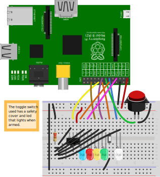

ship-it
-------
Ship-It is a pysical device (currently a box containing a Raspberry Pi) and software that can be used to trigger events in remote systems.  The current implementation is a python script making curl requests to TeamCity to start deploys.  The software design goals were to use the software packages natively available on the Raspbian OS and to make the installation/setup as simple as possible.

The hardware design is entirely thanks to [@justinisamaker](https://twitter.com/justinisamaker) and the current software is an adaptation of his design [here](https://github.com/justinisamaker/raspberrypi/tree/master/teamcityLaunchButton).  Many thanks go to Justin for the original creation.

Ship-It has only been tested on a Raspberry Pi, but could conceiveably be adapted for other systems.

hardware configuration
----------------------
I used [Fritzing](http://fritzing.org/) to create the diagram.

You can find the `fzz` file in the repo root.  I'll supply a parts list at some point in the future...

main.py
-------
This is the main script used by ship-it to communicate with the GPIO, make lights blink and fire off the remote requests.

#### configuration
As you'll see in `main.py`, the curl credentials come from the system environment variables:

	TEAMCITY_USER = os.environ.get("SHIP_IT_TEAMCITY_USER")
	TEAMCITY_PASS = os.environ.get("SHIP_IT_TEAMCITY_PASS")

You can set these environment variables as you see fit or edit the python to contain the credentials.

init
----
The `ship-it.sh` script is a pretty straightforward sysvinit script that uses a bit of bash exec trickery to ensure that stdout is not buffered.  You'll notice that main.py is run by root.  This is required to be able to communicate with the GPIO pins.

packaging (experimental)
---------
I use [fpm](https://github.com/jordansissel/fpm) to package Ship-It.  Here's the command:

	fpm -s dir -t deb -n ship-it -v 1.0 --deb-init ./ship-it.sh --deb-user pi --deb-group pi ./main.py=/home/pi/ship-it/main.py

installation
------------
You can either install the deb package:

	wget https://example.com/artifacts/ship-it_1.0_amd64.deb
	sudo deb -i ship-it_1.0_amd64.deb

Or you can clone & copy:

	cd ~
	git clone https://github.com/lanyonm/ship-it.git
	cd ship-it
	sudo cp ./ship-it.sh /etc/init.d/ship-it
	sudo chmod +x /etc/init.d/ship-it
	sudo update-rc.d ship-it defaults

todo
----
- [ ] add bzz sound when launch is pressed but the box isn't armed
- [ ] external config file to define pins, wiring, resistors, etc.
- [ ] make install location/prefix configurable
- [ ] make the http request internal to python (instead of making system calls)
- [ ] figure out licensing for sounds